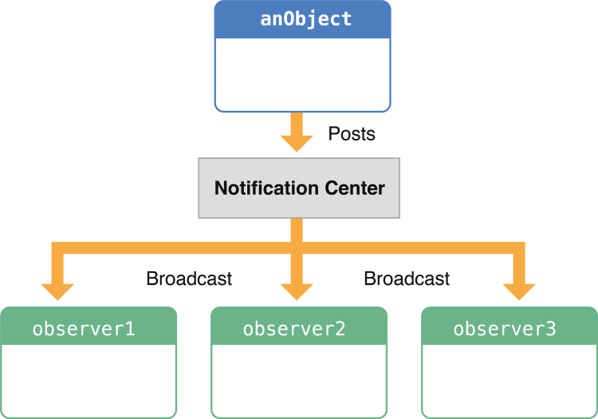

# Delegation Pattern
# 프로토콜

프로토콜은 특정 task나 functionality를 위한 메소드, 프로퍼티, 그 외의 요구사항들의 청사진을 정의한다.
클래스, 구조체, ENUM은 프로토콜을 적용하여 그 요구사항들의 실제 구현을 제공한다.
어떤 타입이 특정 프로토콜의 요구사항을 만족시키면, 그 타입이 프로토콜을 conform한다고 한다.
특히, delegate의 스펙이 @protocol에 정의되어 있기 때문에, delegate를 사용할 때 꼭 프로토콜도 따라다닌다.

## 프로토콜의 구조

```swift
protocol SomeProtocol {
    func someFunction() -> Int
    var someProperty: String { get set }
    optional func anotherFunction()
}
```

프로토콜 내부에는 메소드나 프로퍼티 등을 구현하지 않고, 이름만 정의한다.
위 예시에서는 someFunction() 이라는 메소드와 someProperty의 getter와 setter가 필요하다는 의미로 이해하면 된다.
anotherFunction()은 optional이 앞에 붙어있다. 이것은 스위프트의 자체의 optional과 비슷하게 생각할 수 있는데,
해당 프로토콜을 구현할 때 anotherFuntion()를 구현하는 것이 필수가 아니라는 의미이다.

프로토콜 내부에는 메소드 프로퍼티의 getter와 setter 뿐만 아니라 static func나 class func와 같은
정적 멤버 구현요구도 정의할 수 있다.

## 프로토콜 사용법

```swift
struct SomeStruct: SomeProtocol {
    func someFunction() -> Int  {
        return 0;
    }

    var someProperty: String {
        get {
            return "from someProperty"
        }
        set {
            self.someProperty = newValue + "!"
        }
    }
}
```

구조체와 클래스는 사용할 프로토콜의 이름 오른쪽에 콜론(:)을 붙여서 사용할 수 있다.
이는 클래스에서 상속시 부모클래스를 명시하는 것과 유사하다.

앞선 예제는 정의한 SomeProtocol 프로토콜을 특정 구조체에서 구현한 것이다.
이때, 프로토콜을 쓴다고 한 후에 구현하지 않으면, 구현하지 않았다는 에러가 발생한다.

구조체에서는 클래스에서 상속을 하는 것 처럼 특정 프로토콜을 사용한다고 위와 같이 명시할 수 있다.
클래스 또한 같은 방식으로 프로토콜을 사용할 수 있다.

## 주의점

 * 프로토콜을 특정 구조체에서 사용한다고 한 후에 구현하지 않으면, 구현하지 않았다는 에러가 발생한다.

 * 하나의 클래스는 단 하나의 클래스만 상속 받을 수 있고 여러개로 상속받는 것이 불가능 하지만
 , 하나의 클래스에서 여러개의 프로토콜을 사용하는 것은 가능하다.
```swift
class AnotherSomeClass: SomeClass, SomeProtocol, AnotherProtocol {
    ...
}
```

제일 처음에 오는 SomeClass는 클래스를 상속받은 것이고,
뒷따라 오는 SomeProtocol과 AnotherProtocol은 여러개의 프로토콜을 요구받은 것이다.


## Delegation이란?
- 사전적 정의
> 델리게이트 : 대리자, 위임자
무언가를 대신 해주는 것
어떤 객체가 해야하는 일의 일부를 대신 처리한다.
(완전히 다 대신하는 것은 아니다.)


Delegation Pattern은 특정 클래스가 하는 일 중 일부를 자신의 커스텀 클래스에서 대신 처리하기 위해 사용하는 패턴으로 UIKit의 UITableViewController, UICollectionViewController, UITextField 등 다양한 클래스에서 사용된다.

- 알아 두어야 할 개념 두가지
    - 처리하라고 시키는 객체, 처리할 객체
    - 처리할 객체가 처리하라고 시키는 객체의 일의 일부를 대신 처리한다.


## 예시 - UITextFieldDelegate
- 처리하라고 시키는 객체 : UITextField
- 처리할 객체 : ViewController

```swift
open class UITextField: UIControl, UITextInput, NSConding, UIContentSizeCategoryAdjusting {
	...
	weak open var delegate: UITextFieldDelegate?
	...
}
```

먼저 UITextField에 정의된 delegate 프로퍼티를 살펴보면 그 타입은 UITextFieldDelegate이다. 이 delegate로 UITextFieldDelegate 프로토콜을 구현한 어떤 클래스를 지정하면 UITextField가 하는 일 중 일부를 delegate로 지정된 클래스에서 처리하게 된다.

```swift
public protocol UITextFieldDelegate : NSObjectProtocol {
	...
	optional public func textFieldShouldBeginEditing(_ textField: UITextField) -> Bool
	optional public func textFieldDidBeginEditing(_ textField: UITextField)
	...
}
```

UITextFiledDelegate 프로토콜은 8개의 optional function 으로 되어있으며 delegate에서 함수를 구현하여 텍스트필드의 특정 행동을 처리할 수 있다.

```swift
class ViewController: UIViewController, UITextFieldDelegate {

	...
	var textField: UITextField = UITextField()

	...
	override func viewDidLoada() {
		super.viewDidLoad()

		textField.delegate = self
	}

	...

	// 사용자가 키보드에서 Return 키를 눌렀을 때 ViewController에서 구현된 함수에서 처리
	func textFieldShouldReturn(_ textField: UITextField) -> Bool {
            textField.resignFirstResponder()
            return true
	}
}
```

- UITextField 객체는 중요한 변화(ex: 사용자가 텍스트필드를 눌러서 글쓰기 시작할 때, Return 키를 눌렀을 때 등) 가 있을 때 마다 delegate의 메소드를 호출한다. 사용자는 UITextFieldDelegate에 지정된 함수를 구현함으로서 특정 행동에서 어떠한 처리를 할 수 있게 된다.
- `textField.delegate = self` 이 부분이 ViewController를 textField의 대리자로 지정하는 부분이다.(이 부분이 없으면 키보드를 눌러도 `textFieldShouldReturn` 메소드가 실행되지 않는다.)
- 위와 같이 ViewController에서 UITextFieldDelegate 프로토콜을 구현하면 textField의 delegate로 ViewController로 지정하여 특정 행동을 대신 처리할 수 있게 된다.

## 왜 Delegation을 사용할까?

- 델리게이션을 사용하지 않는다면 어떤 일이 생길까?
    - 택스트 필드의 내용을 일일이 다 객체로 구현해 주어야 한다.
    - 텍스트 필드가 다 똑같은 일을 하면 문제가 크지 않겠지만, 텍스트 필드가 하는 일은 조금씩 다르다.(알파벳 허용 금지, . 두개 허용 금지 등)
- 각각을 일일이 다 구현해주는 방식보다 프로토콜을 사용하여 정해진 메소드만을 구현하도록 하는 것이 재사용성을 고려할 때 더 좋은 방식이다.  

## Delegation말고 다른 방식은 없을까?

- Delegation의 단점
    - Delegation은 1대1 관계, 즉 객체와 객체간의 통신에 적합하다.
    - 그렇기에 객체와 객체간의 통신이 체인을 이루는 경우, 한번의 통신을 위해 여러 단계를 거쳐야하는 단점이 존재한다.
    - 이러한 단점을 해결해주는 방식중 하나는 Notification Center이다.

## Notification Center

- Observation 패턴
    - Observer의 목록을 객체에 등록하여 객체의 상태 변화가 있을시에 목록 내의 Observer에게 통지
    - Observer
        - 객체의 상태 변화를 관찰하는 관찰자들
    - 1:N 관계에 적합하며 Delegation의 단점을 보완하기에 적합
- Notification Center
    - NSNotificationCenter라는 Singleton 객체가 Observer의 역할을 맡는다.
    - 각 객체는 해당 객체를 Notification Center에 등록하여 필요한 경우 Notification Center로 정보를 발송한다.
    - Notification Center는 받은 정보를 등록된 객체들에게 전송한다.
    - 
