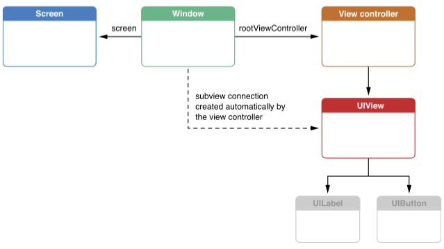

# Life Cycle Method

## Introduction

* ### Topic

  * `UIViewController` 클래스를 상속받은 클래스에서 부모의 Life Cycle Method(예: `viewDidLoad()`, `viewWillAppear(animated:)` 등)를 호출(`super.viewDidLoad()` 등)하는 이유에 대해 토의해 보고, 부모클래스의 메서드를 호출하지 않으면 발생할 수 있는 일에 대해 탐구해보세요.


## View Controller

* ### Concept

  * **ViewController**는 앱의 데이터와 UI간의 중요한 연결고리 역할. iOS앱이 UI를 표시할 때, 표시된 컨텐츠는 **모두 1개 이상 ViewController**에 의해 관리되거나 여러 ViewController 그룹들간 상호 작용을 통해 관리된다.
  * 전통적인 **MView Controller** 디자인에서 컨트롤러 역할 뿐 아니라 더 많은 작업을 iOS에서는 수행한다.
  * **데이터를 표시** 하고 **숨기는 작업**을 조율하고 그 **내용을 관리** 하는 인프라를 제공한다.

* ### Function



    * View 및 기타 리소스들을 간리하는 역할. 윈도우의 rootViewController 속성을 설정하면, 윈도우의 서브뷰로서 해당 ViewController 의 뷰 계층이 들어간다.

    * > ViewController 는 필요할때가 되어야 View 를 로딩함. 특정상황에서는 View 의 리소스를 해제하기도 하므로, 앱내에서 리소스 관리에 있어 중요한 역할을 함.
    > 
    > ViewController 는 연결된 뷰들의 연계 동작을 구현하는 곳. View 는 “버튼이 눌림”이 실제 어떤 작업으로 연결되는지 몰라도, ViewController 는 알 수 있다.
    >
    > ViewController 는 앱의 전체 데이터 중 일부만을 화면에 표시하는 경우가 대부분. 독립적으로 데이터를 나누어 맡아 처리하므로, ViewController 간 연계도 필요하다.

## Discussion

* ### super.viewDidLoad

  * 아무 것도 하지 않더라도 super.viewDidLoad를 항상 호출하는 것이 좋은 습관이다. 
   > 전화하지 않는 습관에 빠지면 필요할 때 전화하는 것을 잊을 수도 있다.
  * 예를 들어, 제 3 자 프레임 워크 나 자신의 코드 기반에서 ViewController에 종속 된 ViewController를 서브 클래싱하는 경우에 super.viewDidLoad를 호출 하는 것이 좋다. (Example)
    ```swift
        class PrintingViewController: UIViewController {
            override func viewDidLoad() {
                super.viewDidLoad()
                print("view has loaded")
                }
        }

        class UserViewController: PrintingViewController {
            override func viewDidLoad() {
            super.viewDidLoad()

            // do view setup here
            }

        }
    ```
* ### ViewController Life Cycle

  * 모바일(iOS)에서는 하나의 화면에 하나의 ViewController만을 가진다.
  * 따라서 여러 개의 ViewController가 모여 하나의 앱을 만든다.
  * iOS에서는 한 화면에서 다른 화면으로 전환할 때 **기존의 화면 위에 새로운 화면이 쌓이는 방식**으로 화면을 전환한다.
  * 이 때 각각의 ViewController는 자신만의 생명주기(LifeCycle)을 가지고 있다. (참고 그림)


  * **이 생명주기를 잘 이해하고 ViewController의 상황에 따라 원하는 로직을 수행하도록 만들어야 한다.**

  * 대표적인 함수들
    * ViewDidLoad 
    > 해당 뷰컨트롤러 클래스가 **생성**될 때(ViewWillAppear전에 실행) 실행된다. Low memory와같은 **특별한 경우가 아니라면 딱 한번만 실행**되기 때문에 초기화 할 때 사용 할 수 있다.
    * ViewWillAppear
    > 뷰 컨트롤러가 화면에 **나타나기 직전**에 실행된다. 뷰 컨트롤러가 나타나기 직전에 항상 실행되기 때문에 해당 뷰 컨트롤러가 나타나기 직전마다 일어나는 작업들을 여기에 배치 시킬 수 있다.
    * ViewDidAppear
    > 뷰 컨트롤러가 화면에 **나타난 직후**에 실행된다. 화면에 적용될 애니메이션을 그리거나 API로 부터 정보를 받아와 화면을 업데이트 할 때 이곳에 로직을 위치시키면 좋다. 왜냐하면 지나치게 빨리 애니메이션을 그리거나 API에서 정보를 받아와 뷰 컨트롤러를 업데이트 할 경우 화면에 반영되지 않는다.
    * ViewWill/DidDisappear
    > 뷰 컨트롤러가 **화면에 사라진 직전/직후**에 실행된다.


## Conclusion

* ### Summary

  * #### 1

    * 2

## References

* [Looking to understand the iOS UIViewController lifecycle](https://stackoverflow.com/questions/5562938/looking-to-understand-the-ios-uiviewcontroller-lifecycle)
* [Apple - UIViewController](https://developer.apple.com/documentation/uikit/uiviewcontroller)
* [View Controller Programming Guide for iOS](https://developer.apple.com/library/content/featuredarticles/ViewControllerPGforiPhoneOS/DefiningYourSubclass.html#//apple_ref/doc/uid/TP40007457-CH7-SW1)
* [Apple View Controller Programming Guide for iOS](https://github.com/joonhwan/study/blob/master/objc/LearnViewController.org)
* [Why/when do we have to call super.ViewDidLoad?](https://stackoverflow.com/questions/40151723/why-when-do-we-have-to-call-super-viewdidload)
* [앱 생명주기(App Lifecycle) vs 뷰 컨트롤러 생명주기(ViewController Lifecycle) in iOS](https://medium.com/ios-development-with-swift/%EC%95%B1-%EC%83%9D%EB%AA%85%EC%A3%BC%EA%B8%B0-app-lifecycle-vs-%EB%B7%B0-%EC%83%9D%EB%AA%85%EC%A3%BC%EA%B8%B0-view-lifecycle-in-ios-336ae00d1855)