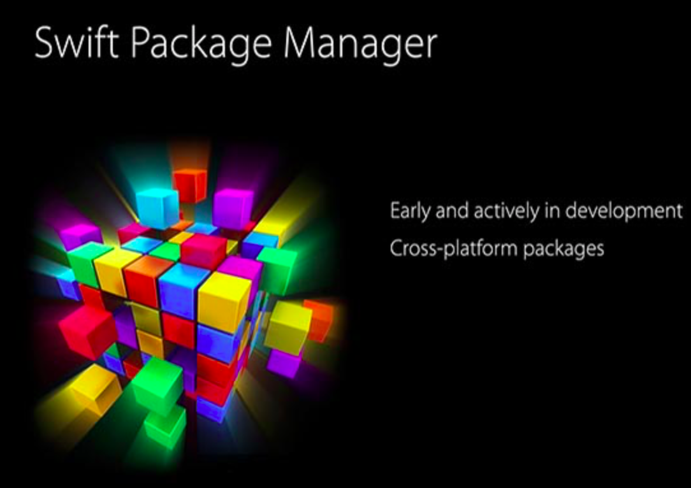

# Dependency Manager

## Introduction

* ### Topic

  * iOS 앱 제작에 활용되는 의존성 관리도구 종류를 알아보세요.

## Dependency Manager?

> 의존성 관리 툴은 우리가 사용하는 모듈을 일괄 관리 해주는 역할을 한다.


* ### Dependency Manager In Swift

  * CocoaPods / Carthage / Xcode Maven / Xcode Gradle / etc...

* Why?

  > 우리가 모듈을 직접 포함시키면, 모듈에 버그가 있을 가능성을 배제한 채, 어쩌면 구버전이 되어버린 모듈을 이용하여 배포하는 꼴이 되는 것이다.
  >
  > 의존성 관리 도구가 필요한 이유는 바로 여기서 두각을 나타낸다.

## Discussion

* ### Carthage
> Carthage(카르테지)는 Swift언어기반의 라이브러리 관리도구이다. 
>
> 코코아 라이브러리 관리도구로 유명한 CocoaPods는 자동으로 작업공간을 생성하고 업데이트하는등의 다양한 기능이 있지만, Carthage는 심플하고 유연하고 불편한 것들을 없앤 도구이다.

  * Adventages
    * 커뮤니티 활성화가 높다(버그가 있으면 대체로 1일이내 수정 PR이 전송된다)
    * 환경 의존도 낮다 (100% Swift로 되어 있어 CocoaPods와 다르게 각각의 환경에서 Ruby버전차이로 발생하는 문제가 없다)
    * 단순하다 (Carthage 다운로드를 하면 바로 사용가능하다.)

  * Why Carthage?
    * 컴파일시간이 짧아지기 때문이다. 
      > 이유는 Carthage라이브러리를 설치하면 해당 라이브러리를 미리 빌드하고 프레임웍을 만들어주기 때문에 CocoaPods에 비해 컴파일 시간을 단축시킬 수 있다.


  * Summary
    > Carthage는 dynamic framework를 만드는 것으로 iOS8이상 대응이고 그 이하는 도입하기 어렵다. 그런 이유로 iOS앱 개발시 지원운영체제 버전을 iOS8이하버전도 고려한다면 Carthage는 사용할 수 없다.

* ### CocoaPods

```
 코코아포드(cocoapods)는 스위프트(swift)와 오브젝티브씨(Objective-c) 개발에 사용되는 의존성 관리자이다.

 앱 개발을 하다보면 오픈소스 라이브러리의 업데이트에 따른 관리를 지속적으로 해줘야 하는데 사용하는 라이브러리가 늘어나게 되면서 관리에 드는 시간이 점점 많아지게 되고 코코아포드(cocoapods)는 이런 귀찮은 일을 자동화하고 시간을 절약하게 한다.

 여러 의존성 관리자가 있지만 코코아포드(cocoapods)는 가장 널리 쓰이는 도구 중 하나이다.
```

> CocoaPods is a dependency manager for Swift and Objective-C Cocoa projects. It has over 29 thousand libraries and is used in over 1.8 million apps. CocoaPods can help you scale your projects elegantly.
>

  * From [CocoaPods Official Site](https://cocoapods.org)

  * Install
    * Bash

      ```shell
      sudo gem install cocoapods
      pod setup
      pod init
      ```
    * Edit PodFile

      ```ruby
      # Uncomment the next line to define a global platform for your project
      # platform :ios, '9.0'

      target 'cocoapods_test2' do
        # 스위프트를 사용하지 않고 동적 라이브러리를 이용하지 않는다면 아래 구문을 주석처리 합니다
        use_frameworks!

        # 여기에 설치할 라이브러리를 나열합니다.
        pod 'Alamofire'
      end
      ```
    
    * Install libraries
      ```shell
      pod install
      ```

* ### CocoaPods

  * Characteristics
    * 2015년 9월 Swift가 오픈 소스가 되면서 한 주요 발표
      * 리눅스에서도 사용 가능
      * Core Library 개선
      * Swift 패키지 매니저: 2016 WWDC에서 만들고 있다고 소개
    * 2016년 WWDC에서 큰 발표가 없었으므로 2017년 WWDC 관전 포인트를 주제로 함
    * HomeBrew의 개발자 Max Howell이 2015년 8월 Apple 입사



  * Insatll
    * Swift Snapshots에서 Swift Dev. Snapshot 설치
    * Dev Snapshot 설치
        * /Library/Developer/Toolchains 아래 /usr/bin/ 폴더에서
        * swift-build와 swift-package이 설치됨을 확인
        * Xcode 버전에 따라 터미널에서 아래 명령 실행
        ```shell
        // 7.3 version
        export TOOLCHAINS=swift
        // 7.2 version
        export PATH=/Library/Developer/Toolchains/swift-latest.xctoolchain/usr/bin:"${PATH}"
        ```

## References

* [A review of iOS dependency managers](https://a-coding.com/a-review-of-ios-dependency-managers/)
* [의존성 관리 도구](https://medium.com/@miles3898/의존성-관리-도구-dependency-manager-612047ced556)
* [Swift Package Manager- 스위프트 패키지 매니저 미리 맛보기](https://news.realm.io/kr/news/swift-package-manager/)
* [코코아포드(cocoapods) 초간단 설치 및 사용법](https://jwkcp.github.io/2017/03/22/cocoapods_with_alamofire/)
* [What’s New in Swift 4?](http://kka7.tistory.com/82)
* [iOS개발질문 - cocoapod과 carthage 어떤것을 사용하시나요? - 아이폰데브, iOS 개발자 커뮤니티](http://iphonedev.co.kr/iOSDevQnA/35892)
* [Carthage vs. CocoaPods vs. Git submodules – Real Life Programming – Medium](https://medium.com/real-life-programming/carthage-vs-cocoapods-vs-git-submodules-9dc341ec6710)
* [CocoaPods Official Site](https://cocoapods.org)
* [Alamofire - Github](https://github.com/Alamofire/Alamofire)