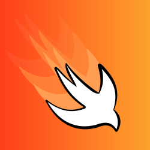

# Swift

## Introduction

* ### Topic

  * 이미 알고있던 언어와 Swift와의 다른 점에 대해 정리해봅시다봅시다.
    * 기존의 언어에 없던 기능/문법
    * 기존의 언어에서 불편했던 점이 어떻게 해결되었을까?
    * 등등
  * Swift의 특징을 살릴 수 있는 프로그래밍 방법엔 무엇이 있을까요?
  * 제한시간 : 60분


## Swift

> Swift는 C 언어 그리고 Objective-C 언어의 좋은 점들을 취합한 것을 기반으로 C 언어 호환성 에 대한 제약 없이 주로 iOS와 OS-X 앱을 개발 하기 위한 언어다. Swift는 안전한 프로그래밍 패 턴을 채용했고 프로그래밍을 더 쉽고, 유연하게 만들었다.



* ### 특징

  > 애플은 Swift를 위해 현존하는 진보한 컴파일러, 디버거, 프레임워크 기반의 토대를 만들었다.
  >
  > ARC(Auto Reference Counting)로 메모리 관리를 단순화 했고 Foundation(Apple Foundation Framework)과 코코아의 견고한 기초를 기반으로 만들어진 프레임워크 스텍은 최신화와 표준화의 결과물이다.
  >
  > Objective-C는 블록 방식 코딩, 문자 집합, 모듈, 혼란없는 최신 언어 기술 프레임워크 적용 가능 등을 지원하도록 발전해왔다.
  >
  > 이전 세 대의 언어인 Objective-C의 단점을 보완하며 새로이 설계된 Swift는 같은 LLVM컴파일러로 빌드되며 같은 런타임을 사용한다.
  >
  > 클로저, 다중 리턴 타입, 네임스페이스, 제네릭스, 타입 인터페이 스 등 Objective-C에는 없었던 현대 프로그래밍 언어가 갖고 있는 기능을 많이 포함시켰으며, 이 에 따라 일정한 성능향상을 보이고 있다.
  >
  > 스위프트는 빠른 성능을 위해 Compile-time method binding, Strong typing and compile time optimization, Memory layout optimization 기술을 적용해 설계 되었다.

## C++ VS Swift

### c++에 없었던 기능 or 문법?

* 스위프트는 인터프리터로 실행 가능!
  * c++과 스위프트 둘 다 컴파일언어지만, 스위프트는 인터프리터로 바로 실행이 가능하다.
스위프트는 인터렉티브 플레이그라운드가 존재하는데 이걸 인터프리터 기반이라고 볼 수 있다.
이렇게 좌측화면에서 코딩을 하면 우측에 화면에 한줄 씩 바로 결과를 확인할 수 있어서 
반복적인 디버깅 장업을 비쥬얼적인 형태로 바로 볼 수 있어서 빠르게 결과를 얻는데 도움을 준다.


### 그밖의 비교
  * 스위프트는 신생언어라 써드파티 지원이 약하다
    * c++ 은 네트워크나 그래픽 사용자 인터페이스 같은 걸 사용하기 용이
    * 프로그래밍에서의 서드파티란 프로그래밍을 도와주는 Plug_in 이나 library 등을 만드는 회사


## JAVA

* ### 특징
  * 객체 지향을 적극적으로 사용하며 저수준 작업들을 자동으로 처리해 주는 고수준 언어이고, 심지어 다른 고수준 언어들에 비해 빠른 편이다.
  * 바이트 코드인 클래스 파일을 생성하고, 이 파일을 일종의 에뮬레이터인 Java 가상 머신(JVM)이 해석하여 실행한다.
  * 태생적으로 타고난 장점으로 플랫폼에 독립적인 언어지만 동시에 메모리 관리에 타고난 약점을 가지게 되었다.
  


## Discussion

* ### 기존의 언어에 없던 기능/문법

  * 2

* ### 기존의 언어에서 불편했던 점이 어떻게 해결되었을까?

  * 불변
C++ :
```C++
class Puter {
void compute(obj *ptr);
void compute(const Obj *ptr);
void compute(Obj * const ptr);
void compute(const Obj * const ptr);
void compute(const Obj * const ptr) const;
};

Swift : 
var dateString = formatter.stringFromDate(date)
// vs
let dateString = formatter.stringFromDate(date)
```

```
var dateString = formatter.stringFromDate(date)
// vs
let dateString = formatter.stringFromDate(date)
```

* 옵셔널 : 타입 세이프한 언어이다.컴파일시에 nil 체크를 수행함으로써 잠재적인 에러를 탐지할 수 있다.

* 문자열 :  "+="를 사용하여 문자열을 쉽게 연결하고, "isEqualToString :" 대신 "=="을 사용하여 문자열을 비교할 수 있다.

* generic : 제네릭을 제공한다.


* ### 추가적인 차이점1?

  * 

* ### Swift의 특징을 살릴 수 있는 프로그래밍 방법

  * 

## References

* [Go vs Swift vs C++ microbenchmark](http://lionet.livejournal.com/137511.html)
* [COMPARISON OF MODERN C++ AND APPLE’S SWIFT PROGRAMMING LANGUAGE SYNTAX](https://blog.michaelckennedy.net/2014/12/08/comparison-of-modern-c-and-apples-swift-programming-language-syntax/)
* [BenchmarkInMultipleLanguages](https://github.com/spb829/BenchmarkInMultipleLanguages)
* [Java vs Swift detailed comparison as of 2017 - Slant](https://www.slant.co/versus/112/6521/~java_vs_swift)
